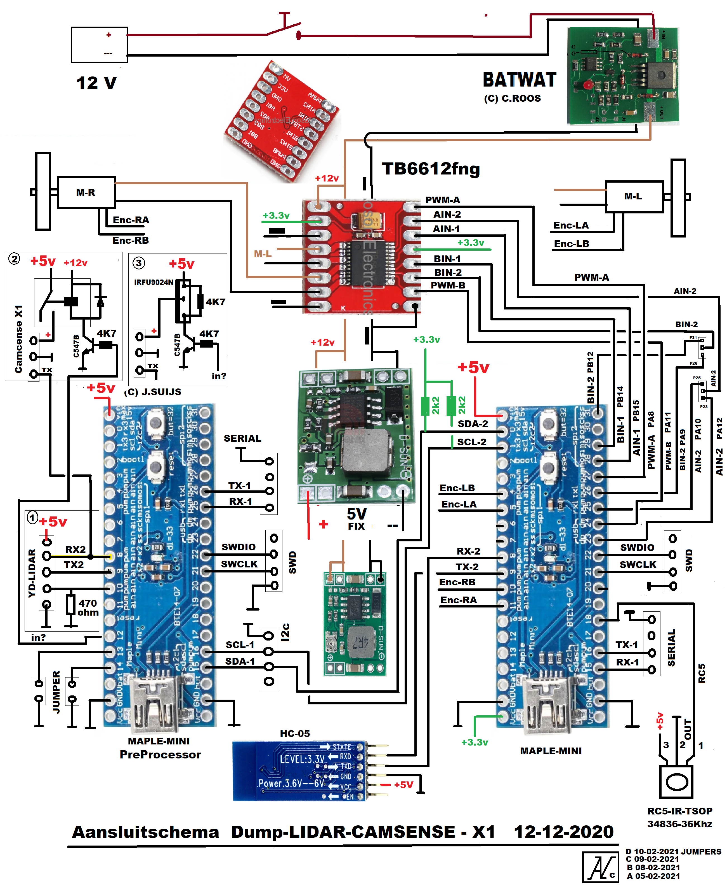

# LiMaPlanck

LiMaPlanck staat voor Lidar-Maple-Planck.

* Planck is een familie van robots, gebaseerd op snijplanken.
* Maple, of eigenlijk de Maple Mini is de gebruikte controller (STM32F103CB).
* De Lidar is aangesloten via een LPP - Lidar PreProcessor. Dit is een tweede Maple mini.

Dit project toont een aantal technieken die handig zijn bij de besturing van robot. Het is een verdere uitwerking van de robot die in de CAR workshop is gebouwd.

