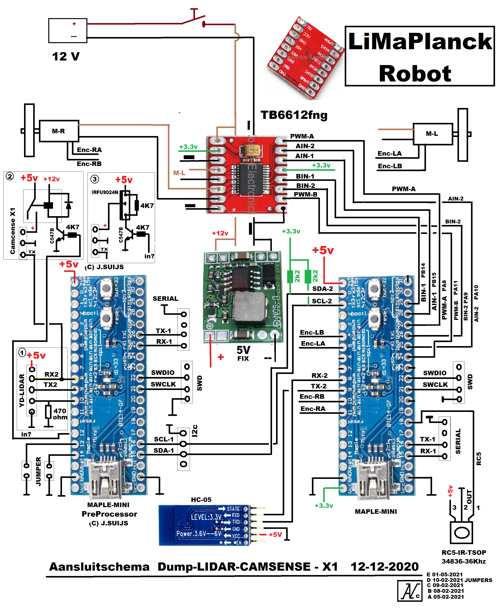

# LiMaPlanck

LiMaPlanck staat voor Lidar-Maple-Planck.

* Planck is een familie van robots, gebaseerd op snijplanken.
* Maple staat voor Maple Mini, het gebruikte controllerboard met de STM32F103CB processor.
* De Lidar is aangesloten via een LPP - Lidar PreProcessor. Dit is een tweede Maple mini.

Dit project bevat de code van de hoofd-controller en toont een aantal technieken die handig zijn bij de besturing van robot.
Het is een verdere uitwerking van de robot die in de CAR workshop is gebouwd.

De robot maakt gebruik van een STM32F103 controller. De board manager URL voor de arduino plugin:
https://github.com/stm32duino/BoardManagerFiles/raw/main/package_stmicroelectronics_index.json

De binary van de Lidar PreProcessor is beschikbaar. De broncode is geen open source.

## IO map

Optioneel   | Core   | Naam      | pin#   | ----   | pin#   | Naam      | Core   | optioneel    |
:---:       | :---:  | :---:     | :---:  | :---:  | :---:  | :---:     | :---:  | :---:        |
 \#         | 5V     | Vin       | \-     | <--->  | 31     | PB12      | \-     | \-           |
 \-         | SDA2   | PB11      | 0      | <--->  | 30     | PB13      | \-     | \-           |
 \-         | SCL2   | PB10      | 1      | <--->  | 29     | PB14      | B-in1  | \-           |
 \-         | \-     | PB2/Boot  | 2      | <--->  | 28     | PB15      | A-in1  | \-           |
 Linesensor | \-     | PB0       | 3      | <--->  | 27     | PA8       | A-pwm  | \-           |
 \-         | EncL   | PA7       | 4      | <--->  | 26     | PA9       | B-in2  | \-           |
 \-         | EncL   | PA6       | 5      | <--->  | 25     | PA10      | A-in2  | \-           |
 \-         | \-     | PA5       | 6      | <--->  | 24     | PA11/USB+ | B-pwm  | \-           |
 \-         | Buzzer | PA4       | 7      | <--->  | 23     | PA12/USB- | \-     | \-           |
 \-         | RX2*   | PA3       | 8      | <--->  | 22     | PA13      | SWDIO  | \-           |
 \-         | TX2*   | PA2       | 9      | <--->  | 21     | PA14      | SWCLK  | \-           |
 \-         | EncR   | PA1       | 10     | <--->  | 20     | PA15      | \-     | \-           |
 \-         | EncR   | PA0       | 11     | <--->  | 19     | PB3       | \-     | \Linesensor  |
 \#         | \#     | RESET     | \-     | <--->  | 18     | PB4       | RC5    | \-           |
 Linesensor | \-     | PC15      | 12     | <--->  | 17     | PB5       | \-     | Servo        |
 Linesensor | \-     | PC14      | 13     | <--->  | 16     | PB6       | \-     | TX1          |
 Linesensor | \-     | PC12      | 14     | <--->  | 15     | PB7       | \-     | RX1          |
 \#         | \#     | VBat      | \-     | <--->  | 32     | PB8/BUT   | \-     | \-           |
 \#         | GND    | AV-       | \-     | <--->  | \-     | GND       | GND    | \#           |
 \#         | 3V3    | AV+       | \-     | <--->  | \-     | VCC       | \#     | \#           |

\* RX2 / TX2 is console-poort.